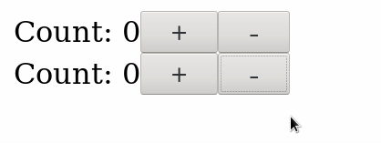
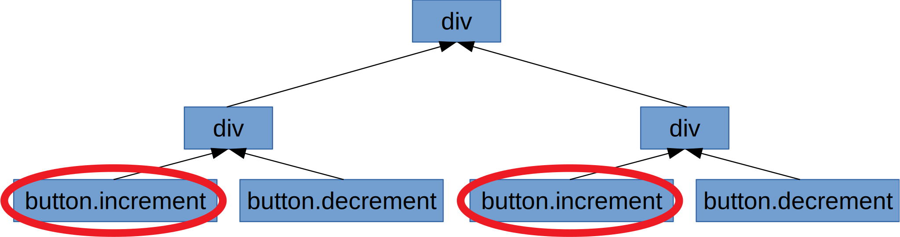
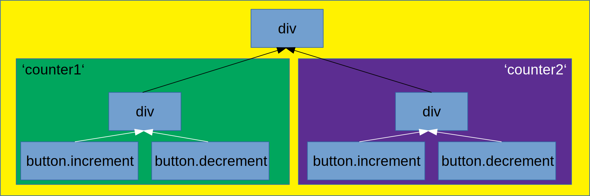

# Inside a framework - How the Cycle.js DOM driver works

Often, we use a framework without really knowing how it works internally. Sometimes we contribute to that framework without having any clue about the inner workings.

For me, this was the case with Cycle.js. I was even invited to be a Core Team Member without having any clue how the DOM part of it worked besides "it uses virtual DOM under the hood".

Lately I stumbled across severe issues in the DOM driver that (together with older issues) convinced me to deep dive into it and rewrite it basicly from scratch.

In this article I want to show you the main algorithm and the data structures that make the DOM driver efficient, but still easy to use.

## The main problem - isolation

A Cycle.js component is just a pure function from some inputs (the sources) to some outputs (the sinks). This looks like this:
```js
function Counter(sources) {
    const increment$ = sources.DOM.select('.increment')
        .events('click').mapTo(+1); // On every click on the .increment
                                    // button emit a 1
    
    const decrement$ = sources.DOM.select('.decrement')
        .events('click').mapTo(-1); // Same but with -1

    const state$ = xs.merge(increment$, decrement$)
        .fold((last, curr) => last.curr, 0) // Starting with 0, add up all
                                            // numbers on the stream

    const view$ = state$.map(count => div([
        span(['Count: ' + count]),
        button('.increment'),
        button('.decrement')
    ]));

    return {
        DOM: view$
    };
}
```
But if you call that function twice:
```js
function main(sources) {
    const sink1 = Counter(sources);
    const sink2 = Counter(sources);

    const view$ = xs.combine(sink1.DOM, sink2.DOM)
        .map(children => div(children));

    return {
        DOM: view$
    };
}
```
You get this:



Why? Because if you take a look at the DOM, you see that there are two elements with the `.increment` class, so either one triggers the emission of events:



You can solve this issue by using `isolate()` which scopes the events to their components:
```diff
function main(sources) {
-    const sink1 = Counter(sources);
-    const sink2 = Counter(sources);
+    const sink1 = isolate(Counter, 'counter1')(sources);
+    const sink2 = isolate(Counter, 'counter2')(sources);

    const view$ = xs.combine(sink1.DOM, sink2.DOM)
        .map(children => div(children));

    return {
        DOM: view$
    };
}
```


