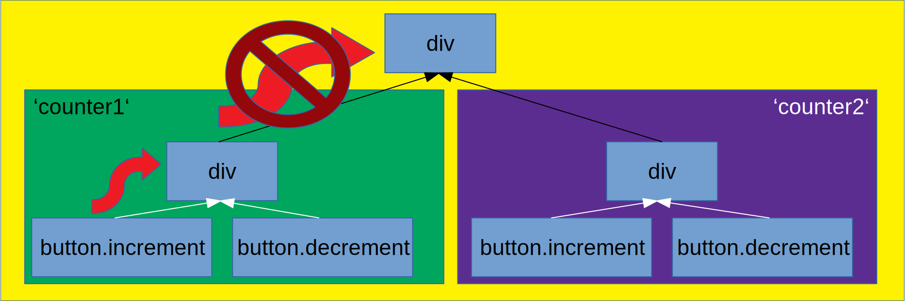
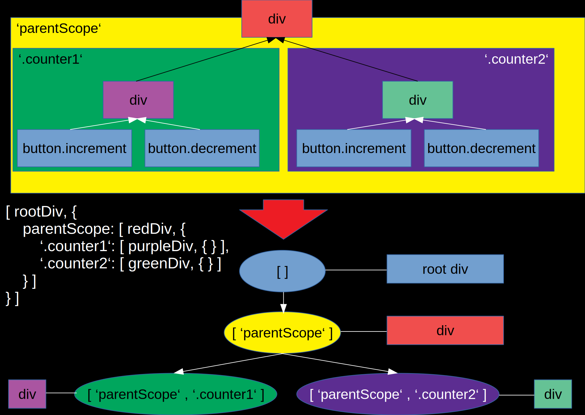

# Inside a framework - How the Cycle.js DOM driver works

Often, we use a framework without really knowing how it works internally. Sometimes we contribute to that framework without having any clue about the inner workings.

For me, this was the case with Cycle.js. I was even invited to be a Core Team Member without having any clue how the DOM part of it worked besides "it uses virtual DOM under the hood".

Lately I stumbled across severe issues in the DOM driver that (together with older issues) convinced me to deep dive into it and rewrite it basicly from scratch.

In this article I want to show you the main algorithm and the data structures that make the DOM driver efficient, but still easy to use.

## The main problem - isolation

A Cycle.js component is just a pure function from some inputs (the sources) to some outputs (the sinks). This looks like this:
```js
function Counter(sources) {
    const increment$ = sources.DOM.select('.increment')
        .events('click').mapTo(+1); // On every click on the .increment
                                    // button emit a 1
    
    const decrement$ = sources.DOM.select('.decrement')
        .events('click').mapTo(-1); // Same but with -1

    const state$ = xs.merge(increment$, decrement$)
        .fold((last, curr) => last.curr, 0) // Starting with 0, add up all
                                            // numbers on the stream

    const view$ = state$.map(count => div([
        span(['Count: ' + count]),
        button('.increment'),
        button('.decrement')
    ]));

    return {
        DOM: view$
    };
}
```
But if you call that function twice:
```js
function main(sources) {
    const sink1 = Counter(sources);
    const sink2 = Counter(sources);

    const view$ = xs.combine(sink1.DOM, sink2.DOM)
        .map(children => div(children));

    return {
        DOM: view$
    };
}
```
You get this:


Why? Because if you take a look at the DOM, you see that there are _two_ elements with the `.increment` class, so either one triggers the emission of events:


You can solve this issue by using `isolate()` which scopes the events to their components:
```diff
function main(sources) {
-    const sink1 = Counter(sources);
-    const sink2 = Counter(sources);
+    const sink1 = isolate(Counter, 'counter1')(sources);
+    const sink2 = isolate(Counter, 'counter2')(sources);

    const view$ = xs.combine(sink1.DOM, sink2.DOM)
        .map(children => div(children));

    return {
        DOM: view$
    };
}
```


## Building the bridge between APIs

The goal of us is to build the bridge between the declarative API of the DOM driver including isolation and the native DOM API of the browser.

For this we need to know how the browser processes events. When an event is emitted on an element it first runs through the **capture phase**. This means the event runs top down from the `<html>` to the `<button>` in our case, triggering the event listeners that specified `useCature: true`.

Then, the more well known **bubbling phase**. Now the event runs bottom up through the DOM tree, triggering all event listeners that were not triggered in the capture phase.

So for our isolation we want to stop the events from propagating outside of the current scope. Sadly we can't use `stopPropagation`, because the capture phase always starts at the root of the DOM tree, not the root of our isolation scope.

We want the bubbling phase to look like this:



## Implementing a custom event propagation algorithm

As we already said, we can't use the native event bubbling of the DOM. To make our live a bit easier, we will just attach an native event listener at the root of our cycle app, and use the bubbling to catch all events that happen in the DOM with just one listener (yes, there are events that do not bubble, but I will exclude them for sake of simplicity here).

This root event listener looks like this:
```js
root.addEventListener('click', function(event) {
    const element = event.target;
    // do something
});
```

We know the element where the event happened, but not in which isolation scope this element is, as the DOM does not know anything about isolation. This means we need a mapping from element to isolation scope.

But remember how I said before, the only thing I know about the DOM driver is, that it uses virtual DOM under the hood? How do we get the actual DOM nodes, and not the vnodes?

## Hooking into the VDOM

Snabbdom, the virtual DOM implementation that Cycle.js uses, allows to create modules that can hook into the DOM node create/update/delete live cycle. A basic module looks like this:
```js
const myModule = {
  create: function(emptyVnode, vnode) {
    // invoked whenever a new virtual node is created
    // the actual DOM element is under vnode.elm
  },
  update: function(oldVnode, vnode) {
    // invoked whenever a virtual node is updated
  },
  delete: function(vnode) {
    // invoken whenever a DOM node is removed
  }
};
```

So if we attach the isolation scope information to the vnode, we can use the `create` hook to save the scope together with a reference to the DOM node.

## Attaching the scope information

If we take a look at the `isolate()` API again, we can see that it is a **higher order function**, so a function that takes a function as input and (in our case) returns a new function:
```js
const isolatedComponentFunction = isolate(Component, scope);
```

If we imagine the inner workings of isolate and ignore all other drivers except DOM, it would look a bit like this:
```js
function isolate(Component, scope) {
    return function IsolatedComponent(sources) { // Return isolated component
        const isolatedSource = sources.DOM.isolateSource(sources.DOM, scope);
        const sinks = Component({ ...sources, DOM: isolatedSource });

        return {
            ...sinks,
            DOM: sources.DOM.isolateSink(sink.DOM, scope)
        };
    }
}
```
So we have two points of attack, `isolateSource` and `isolateSink`. Also, as you can see, `sources.DOM` is an object, not a plain stream, so we can use it store information. We can use `isolateSink` to add this stored information to the virtual dom nodes created by the user. This could look like this:
```js
class DOMSource {
    constructor(namespace) {
        this.namespace = namespace;
    }

    isolateSource(source, scope) {
        return new DOMSource(this.namespace.concat({ type: 'total', scope }));
    }

    isolateSink(vnode$, scope) {
        return vnode$
            .map(node => ({
                ...node,
                data: {
                    ...node.data,
                    isolate: this.namespace.concat(scope)
                }
            }));
    }
}
```
Now we can use a Snabbdom module to hook into the DOM creation and keep track of namespaces and elements:
```js
class IsolateModule {
    constructor() {
        this.namespaceMap = new Map();
    }
    
    createModule() {
        const self = this;
        return {
            create(empty, vnode) {
                if(vnode.data && vnode.data.isolate) {
                    self.namespaceMap.set(vnode.elm, vnode.data.isolate);
                }
            },
            delete(vnode) {
                self.namespaceMap.delete(vnode.elm);
            }
        };
    }
}
```

## Using the information to distribute events

To get our desired API of `sources.DOM.events(eventType)`, we have to implement a function called `events` on our DOM source. This function has to register its event type in a central place that we will call the **event delegator**. Why? Because that is where we will implement the custom event bubbling functionality. This register function has to return a stream of future events that the function can return to the user. We will also add a `select` function that just adds a css selector to the namespace so element can be filtered for those later.
```js
class DOMSource {
    constructor(eventDelegator, namespace) {
        this.namespace = namespace;
        this.eventDelegator = eventDelegator;
    }

    events(eventType) {
        return this.eventDelegator.registerListener(this.namespace, eventType);
    }

    select(selector) {
        return new DOMSource(
            this.eventDelegator, this.namespace.concat({
                type: 'selector', scope: selector
            })
        );
    }

    isolateSource(source, scope) { /* ... */ }
    isolateSink(vnode$, scope) { /* ... */ }
}
```
How can we implement `registerListener`? How can we return a stream of events even if they have not happened yet? The answer to this question is a **subject**. A subject is like beginning of a conveyor belt. Its output is a stream of events, but you can put events onto the stream via function calls.

```js
class EventDelegator {
    constructor(isolateModule) {
        this.isolateModule = isolateModule;
    }

    registerListener(namespace, eventType) {
        const subject = xs.create(); // our subject
        // TODO: save subject with namespace in some data structure
        return subject;
    }
}
```
We want to save all listener subjects in a central data structure. This data structure should be able to give me a subject when I give it the namespace. Our first impulse would be to use a `Map` again, but this is not possible due to the namespace being an array:
```js
let test = new Map();
test.set([1,2,3], "test");
test.get([1,2,3]); // undefined
```
The problem is, that Javascript does not check if the arrays are *equal* but *identical*. This means, that this would work:
```js
let test = new Map();
const arr = [1,2,3];
test.set(arr, "test");
test.get(arr); // "test"
```
So, we need a different data structure here.

## Trees to the rescue

As our application is a tree of components, just as the DOM is a tree of nodes, our isolation scopes will also be like a tree, where each subtree shares the parent's namespace plus additionally has scopes of its own. So we can implement a tree that can carry an element at every node, plus has children that refer to scopes. See the type signatures for such a tree:
```ts
type Node = [Element | undefined, InternalTree];
interface InternalTree {
    [scope: string]: Node;
}
```
As you can see, a `Node` is an Element (or `undefined`) and an object containing the scopes as keys and again Nodes as Values. As you can see, this is a recursive definition. To make it easier to grasp, here is an example drawing of one such tree:



The implementation details of this tree is not that important, but if you are interested you can see it on [GitHub](https://github.com/cyclejs/cyclejs/blob/b1197f2252b7065fd40e720f1aef2196d9ee2225/dom/src/SymbolTree.ts).

## Finishing our listener registration

With this tree we can finally implement `registerListener` (note that here we only allow one listener per namespace for simplicity).

```js
class EventDelegator {
    constructor(isolateModule) {
        this.isolateModule = isolateModule;
        this.listenerTree = new SymbolTree();
    }

    registerListener(_namespace, eventType) {
        let namespace = _namespace.filter(scope => scope.type !== 'selector');
        let map = this.listenerTree.get(namespace);
        if(map && map.get(eventType)) {
            return map.get(eventType);
        }

        if(!map) {
            map = new Map();
            this.listenerTree.insert(namespace, map);
        }
        
        const subject = xs.create(); // our subject
        const arr = map.get(eventType) || [];

        map.set(eventType, arr.concat({
            namespace: _namespace,
            selector: _namespace.filter(scope => scope.type === 'selector').join(' '),
            subject
        });

        return subject;
    }

    getListeners(namespace, eventType) {
        const map = this.listenerTree.get(
            namespace.filter(scope => scope.type !== 'selector'),
        );
        return map ? map.get(eventType) : [];
    }
}
```

## Writing our own event bubbling

Now we have registered our listeners, but they are still not receiving any events. Time for us to write our own event bubbling implementation.

For this, let's recap where we start at the beginning of each event.
```js
root.addEventListener('click', function(event) {
    const element = event.target;
    // do something
});
```
With our current data structures we can expand this pice of code a bit:
```js
root.addEventListener('click', function(event) {
    const element = event.target;
    const namespace = isolateModule.getNamespace(element);
    const namespaceRoot = isolateModule.getRootElement(namespace);
    const listeners = eventDelegator.listenerTree.get(namespace);

    //TODO: Capture phase, starting at root element, ending at element

    //TODO: Bubbling phase, starting at element, ending at root
});
```
Ideally we would be able to get the bubbling path from the event, and in fact this might be the case in the future with the `event.path` property, but at the moment we have to contruct the bubbling path ourselfs. Each element has a property `parentNode`, so we can just start at the `element` and work upwards to the `namespaceRoot`.
```js
let arr = [];
let curr = element;
while(curr && curr !== namespaceRoot) {
    arr.push(curr);
    curr = curr.parentNode;
}
arr.push(namespaceRoot);

for(let i = arr.length - 1; i >= 0; i--) {
    // do bubble step
}
```
Now we can walk through the array to simulate our bubbling. But this implementation has a big flaw: It allocates an array on every run. This array is not needed afterwards so it will be discarded and eventually garbage collected. If we use an event that happens frequently, like `mousemove`, this could be a real performance bottleneck.

## Recursion to the rescue

Instead of first remembering all elements and then iteration over them, we can also use recursion to walk up the DOM tree, but without allocating an array! For the capture phase, we want to first walk to the topmost element, and then on our way back down we want to execute our bubble logic. The trick is, to go into the recursive call **first** and then do the logic.

```js
function bubble(elm, event)
    if(elm && elm !== namespaceRoot) {
        bubble(elm.parentNode, event);
    }

    // do bubble step
}
```
As you can see, the recursive implementation is not only more performant, but also a lot easier to read. Implementing each bubble step is now fairly easy, we take the css selectors from the listener and check if the element matches this selector.
```js
function doBubbleStep(elm, event) {
    for(let i = 0; i < listeners.length; i++) {
        if(elm.matches(listeners[i].selector)) {
            listeners[i].subject.shamefullySendNext(event);
        }
    }
}
```

## Conclusion

Implementing the DOM driver was a fun challenge. As part of a framework, you expect it to be performant but also easy to use. The implementation should not leak to the user and we have to work in the confines of the APIs we are given.

You can find the whole code of the new DOM driver on [the GitHub PR](https://github.com/cyclejs/cyclejs/pull/759).

If you have questions about the article or the implementation on GitHub, feel free to ask them!
